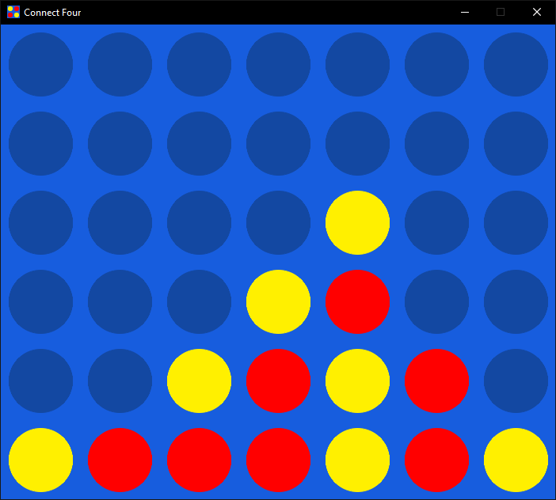

# Deep Learning for playing Connect4

This project is a part of the course <b>Techniques of Artificial Intelligence</b> from the Free University of Brussels (M1 Optimization and Operational Research - 2020 - 2021).

Key words : <code>Supervised Learning</code> <code>Artificial Neural Network</code> <code>Backpropagation</code> <code>Convolutional Filters</code>

## The game UI

Using the connect-4 python game developped by <b>loricvdt</b> accessible here : https://github.com/loricvdt/connect-four

